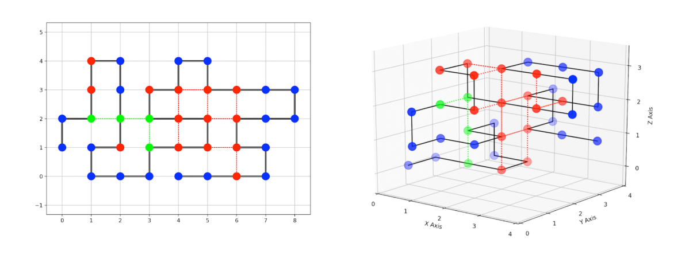

# Protein pow(d)er
In de case proteine pow(d)er is het de bedoeling dat je een proteïne, een ketting van aminozuren, vouwt op een manier waarop de stabiliteit van die ketting zo hoog mogelijk is. Een hoge stabiliteit betekent een zo laag mogelijke stabiliteitsscore. Het blijkt dat een verkeerde vouwing van proteïnen kan zorgen voor kanker, Alzheimer, en taaislijmziekte. Hierdoor is het erg belangrijk om de precieze vouwing van een proteïne te kunnen bepalen. Elke vouwing is een 90 graden hoek, waardoor het probleem op een grid werkt. Er bestaan P, H, en C aminozuren. P (polaire) aminozuren voegen niks toe aan de stabiliteit. H (hydrofobe) aminozuren zorgen voor -1 stabiliteitsscore, wanneer ze naast elkaar liggen maar niet direct verbonden zijn in de ketting. C (cysteïne) aminozuren zorgen voor -5 stabiliteitsscore wanneer ze op deze zelfde manier naast elkaar liggen, terwijl een C en H aminozuur samen zorgen voor -1 stabiliteitsscore.\

# Aan de slag

#### Vereisten

De Codebase is geschreven in python 3.7 en volledig compatible met 3.8. De requirements staan in requirements.txt en zijn met de volgende comment te installeren.
    pip install -r requirements.txt

#### Gebruik
De applicatie wordt uitgeovoerd vanuit main/main.py, waarin de imports van alle bruikbare functies al staan. Ten eersten maak je een nieuw ongeorderde proteine aan met de volgende functie:

    protein1 = Protein(amino_string, dimension_mode)
amino_string: De string van het proteine dat je wil representeren en sorten. (voorbeeld: " CHHCPHPHPHP")
dimensions_mode: De string van de dimensie mode die je wil uitvoeren.("2D" of "3D")

Vervolgens kan je de chain van het proteine opbouwen met een search functie van jouw keuze. Zie XXX voor de algorithmes die beschikbaar zijn. de paramaters verschillen met algorithme. Deze wordt opgeroepen op een protein object alsvolgens.

    search_type__function(protein1, parameter1, parameter2).

#### Output/ visualisatie

Nu de chain is opgebouwd kan je op verschillende manieren een output krijgen. Namelijk:

Print de score die dit proteine heeft gehaald:

    print(protein1.get_score())

Dit print een representatie van het protein in 2d of 3d doormiddel van MatPlotLib.

    protein1.print_protein()

Print een output zoals vereist vanuit de opdracht.

    protein.get_output_list()

# Structuur
De hierop volgende lijst beschrijft de belangrijkste mappen en files in het project, en waar je ze kan vinden:

- /code/ : Bevat alle code van dit project.
    - /code/main.py : De applicatie wordt gerund vanuit deze file.
    - /code/classes/ : Bevat de classes voor de gebruikte objecten.
    - /code/functions/ : Bevat alle helper functies die worden hergebruikt in andere delen van code
    - /code/algorithms/ : Bevat de algorithms die de folds van de aminos bepalen.
    - /code/unfinished/ : Contains the current unfinished/ not working code of the project

# Algorithmes
We zullen van elke geimplementeerde search uitleggen wat die doet, en hoe deze aangeroepen moet worden. Ook wordt voor elke functie aangegeven of deze wordt gesupport in 2d EN 3d, of alleen in 2d.

## vaste variabelen in de functies:

c-h_score:
Dit wordt in de meeste algoritme functies gebruikt. Deze c-h_score geef je als waarde mee aan de functie.
Het is een int en geeft aan hoeveel punten er tijdens het zoeken wordt gegeven voor een C-H bond. Hierdoor kan ervoor gezorgd worden dat het algorithm minder snel een C-H bond legt en zo C aminos overhoud om met elkaar te binden. Bij het berekenen van de uiteindelijke score wordt er nog steeds -1 voor elke C-H bond gerekend. De score wordt automatisch omgezet naar een negatief nummer. Je moet dus een positief nummer invoeren. Wil je de normale score functie gebruiken tijdens het zoeken vul dan voor c-h_score een 1 in.

protein:
Dit is het proteine object dat in elke algoritme functie meegegeven moet worden. Hierin staat de volgorde van de aminozuren opgeslagen. Er is een chain object in opgeslagen waar de gevormde chain in wordt opgeslagen. Op deze manier maak je een proteine aan:

    protein1 = Protein(amino_string, dimension_mode)

Daarna kan je deze proteine meegeven aan de algoritme functie.

## Depth search first.

    depth_search(protein, c-h_score)
beschrijving depth search:
De depth search 

##### Lookahead

    depth_search_lookahead(protein, c-h_score, max_lookahead)
beschrijving:
Dit is een variatie van de depth search die een x aantal stappen diep vooruit kijkt. De volgende stap zet op hij naar de fold die over deze x stappen de beste score opleverde. Bij de volgende stap kijkt hij weer x stappen vooruit en kiest de fold die over deze x stappen de beste score opleverde.

max_lookahead:
Dit is een int die aangeeft hoeveel stappen de lookadhead vooruit moet kijken.

## Branch & bound

    branch_and_bound(protein, c-h_score, best_score_import)
beschrijving

best_score_import:

#### Lookahead

beschrijving
located in /unfinished/.

#### Brand & bound random throwaway

    branch_and_bound_random(protein, c-h_score, best_score_import, p1, p2)

beschrijving.

best_score_import:

p1:

p2:

## Breadth_search

    breadth_search(protein, c-h_score)
beschrijving:
De breadth search verlengd the chain steeds door één nieuwe amino te leggen. Hij begint met het leggen van de eerste Amino met een fold in vastgestelde richting (dit voorkomt dubbel werk omdat de eerste richting niet uitmaakt ivm spiegelingen). Hij voegt deze als chain object toe aan de queue. Hij haalt de eerst toegevoegde chain uit de queue kijkt naar alle mogelijke folds en maakt voor elke mogelijke fold een chain aan van de chain tot dan toe plus de nieuwe fold. Hierbij wordt een deepcopy gemaakt van de chian die net uit de queue is gehaald. Daarna stopt hij de nieuw gemaakte chains weer in de queue en zo gaat hij steeds door totdat hij alle aminos heeft gehad.

#### Beam search

    beam_search(protein, c-h_score, selection_levels

beschrijving:
De beam search werkt volgens hetzelfde principe en initiele structuur als de breadth_search. Het verschil is dat je op verschillende zelf te bepalen levels een selectie kan doen. Deze selectie vergelijkt alle scores op dat niveau en bepaald het gemiddelde. Hij gaat dan alleen verder met de scores die beter zijn dan het gemiddelde, dus de chains met een lagere negatieve score.

Er moet 1 level tussen selection levels zitten omdat het algoritme 2 levels gebruikt om te selecteren. Eerst houdt hij de scores bij van de chains en slaat deze op in de chain en in een lijst om het gemiddelde te bepalen. In het volgende level haalt hij alle chains uit de queue en kijkt hij naar de scoreen gaat alleen verder met de chains die beter of gelijk aan het gemiddelde zijn. Je kan dus selecteren op level 2 en 4 maar niet op level 2, 3 en 4

selection_levels:
Hier kun je in een list de levels meegeven waarop je een selectie wil doen.
bijv.: [2,5,7]

## iterative

describe iterative algos.

#### Hill climbing single

    hill_climbing_single_fold(protein, iterations)
beschrijving

iterations: 
#### Hill climbing caterpillar

    hill_climbing_caterpillar(protein, iterations, max_non_improvements)

beschrijving:
Dit algoritme verlegd de fold van een random geselecteerd amino en past de daarop volgende folds aan zodat de amino daarna of de amino 2 daarna weer op een plek in de begin chain uitkomt. Als er hierdoor ruimte in de chain ontstaat worden de aminos na deze van plek gewisseld zodat de chain weer aansluit.
iterations:
iterations is een int die aangeeft hoevaak een verandering aan de chain wordt uitgevoerd alvorens het programma stopt.
max_non_improvements:
Dit is een int die aangeeft hoe vaak een random fold tot een verbetering moet leiden. Dus als de fold geen verbetering in score geeft wordt de oude staat van de chain hersteld. Als dit net zo vaak is gebeurd als max_non_improvements gaat hij verder met deze chain ongeacht dat het geen betere score geeft. 

#### Simulated annealing

    simulated_annealing(protein, iterations)

beschrijving:

iterations:

## TODO/ To improve
Where to go from here:

- Add 3D support to all functions
- Improve the score lower bound function for brand and bound.
- Instead of the manhatten distance, use a A* algorithm for figuring out which connections spots can still be reached in banch and bround.
- Algorithm functions abstracting by implementing them as classes.
